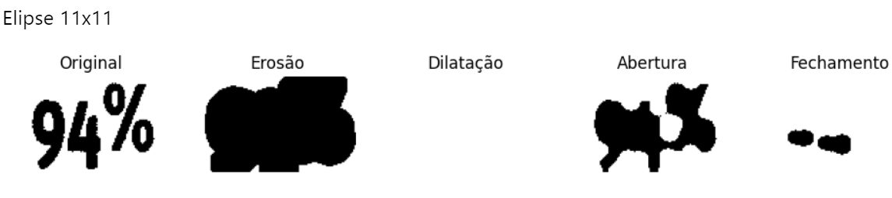
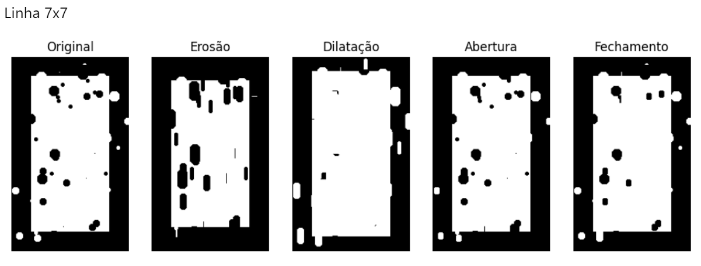
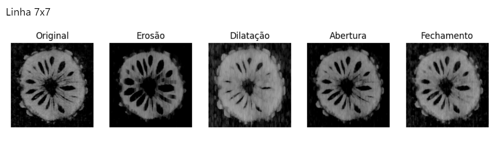
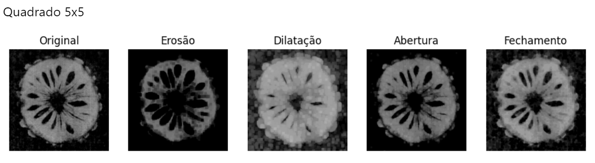

# Morfologia

As operações morfológicas são operações que modificam o formato e a estrutura dos objetos representados em uma imagem. A morfologia utiliza o elemento estruturante, que percorre toda a imagem realizando alguma técnica de morfologia sobre a mesma. Alguns elementos estruturantes são os que possuem formatos de elipse, quadrado, cruz e reta. Para realce de objetos circulares é indicado o elemento estruturante de elipse, enquanto para objetos mais retangulares, o elemento estruturante de quadrado é mais indicado. 

A operação de erosão é caracterizada pela corrosão das arestas dos objetos das imagens, resultando em uma imagem com objetos de tamanho reduzido, realmente, objetos “corroidos”. Já a operação de dilatação é responsável por dilatar os objetos de interesse de uma determinada imagem, resultando em objetos com uma área maior.

A operação de abertura é composta pela operação de erosão seguida da operação de dilatação. Essa operação é frequentemente utilizada para o tratamento de ruídos. Ela é muito interessante, porque após a operação de erosão, muitos ruídos são removidos das imagens, porém nesse processo algumas bordas também podem ser perdidas. Com isso, é utilizada a operação de dilatação com o intuito de reconstruir as bordas que se perderam durante o processo de erosão dos objetos da imagem.  Além disso, a operação de fechamento funciona de forma contrária à operação de abertura. Nela, inicialmente é realizada a operação de dilatação e após isso a operação de erosão.

As imagens abaixo representam os resultados dos experimentos utilizando as operações morfológicas de abertura, fechamento, erosão e dilatação combinadas com diferentes tamanhos e formatos de elementos estruturantes. 

## Elipse

## Linha

## Quadrado

