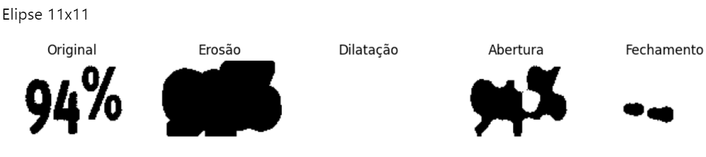
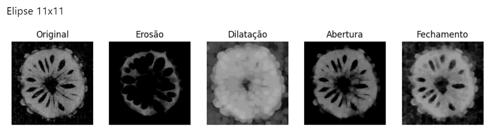
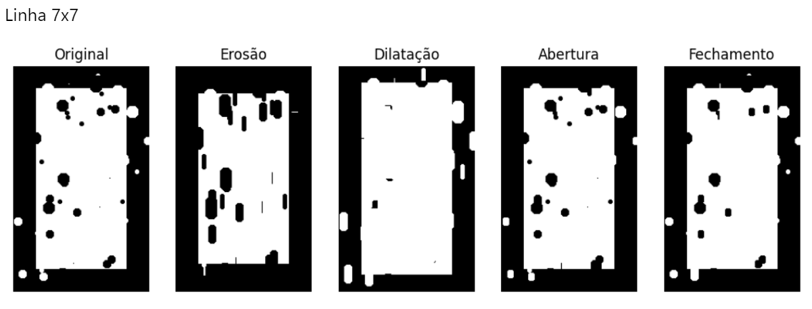
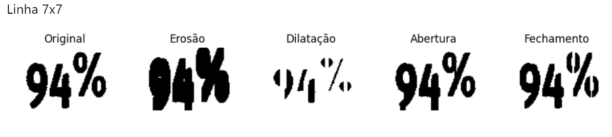
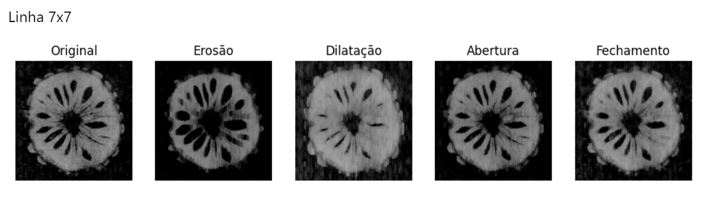
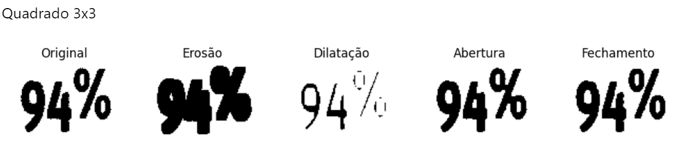
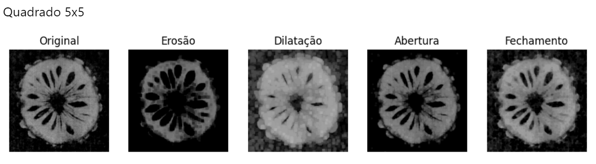
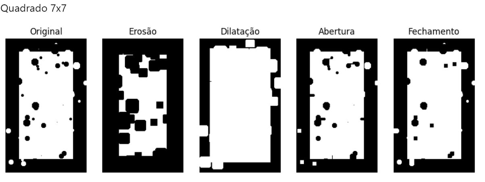

# Morfologia

As operações morfológicas são operações que modificam o formato e a estrutura dos objetos representados em uma imagem. A morfologia utiliza o elemento estruturante, que percorre toda a imagem realizando alguma técnica de morfologia sobre a mesma. Alguns elementos estruturantes são os que possuem formatos de elipse, quadrado, cruz e reta. Para realce de objetos circulares é indicado o elemento estruturante de elipse, enquanto para objetos mais retangulares, o elemento estruturante de quadrado é mais indicado. 

A operação de erosão é caracterizada pela corrosão das arestas dos objetos das imagens, resultando em uma imagem com objetos de tamanho reduzido, realmente, objetos “corroidos”. Já a operação de dilatação é responsável por dilatar os objetos de interesse de uma determinada imagem, resultando em objetos com uma área maior.

A operação de abertura é composta pela operação de erosão seguida da operação de dilatação. Essa operação é frequentemente utilizada para o tratamento de ruídos. Ela é muito interessante, porque após a operação de erosão, muitos ruídos são removidos das imagens, porém nesse processo algumas bordas também podem ser perdidas. Com isso, é utilizada a operação de dilatação com o intuito de reconstruir as bordas que se perderam durante o processo de erosão dos objetos da imagem.  Além disso, a operação de fechamento funciona de forma contrária à operação de abertura. Nela, inicialmente é realizada a operação de dilatação e após isso a operação de erosão.

As imagens abaixo representam os resultados dos experimentos utilizando as operações morfológicas de abertura, fechamento, erosão e dilatação combinadas com diferentes tamanhos e formatos de elementos estruturantes. 

## Elipse

## Linha

## Quadrado

## Discussão

Considerando que os objetos da imagem são os pixels brancos, pode-se notar alguns pontos nos resultados. A operação de erosão tende a erodir os objetos da imagens, com isso a quantidade de pixels escuros tende a aumentar fazendo com que consequentemente a quantidade de pixels brancos diminua. Em contrapartida, na operação de dilatação o processo ocorre de forma contrária, onde os objetos tendem a ter sua área aumentada, logo a quantidade de pixels claros aumentam, diminuindo desta forma a quantidade de pixels escuros. 

Na operação de fechamento, a quantidade de pixels escuros é suavizada, sua região diminui mais de forma sútil, aumentando também a região de pixels claros. Na operação de abertura, ocorre o processo inverso, a região de pixels escuros tem um aumento sutil, diminuindo a região de pixels claros. 

Com relação aos elementos estruturantes, pode-se citar alguns pontos. O elemento em formato de elipse realiza alteração na morfologia da imagem de forma mais circular, é por isso que ele é utilizado em operações com objetos circulares, pois ele tende a preservar ou realçar regiões circulares. Da mesma forma, o elemento estruturante quadrado tende a preservar ou realçar regiões retangulares e realiza a operação na morfologia da imagem de forma “quadrada”. 

Os elementos de linha tendem a achatar verticalmente os objetos da imagem, podem ser eficientes quando aplicados a regiões mais retas e verticais. Além disso, pode-se notar também que quanto maior for o tamanho do elemento estruturante, maior é o efeito na alteração morfológica da imagem. 

## Ferramentas

- Linguagem: Python
- Bibliotecas: OpenCv, Matplotlib, Numpy
- Ambiente de desenvolvimento: Jupyter Notebook