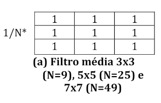
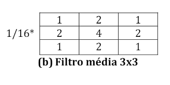
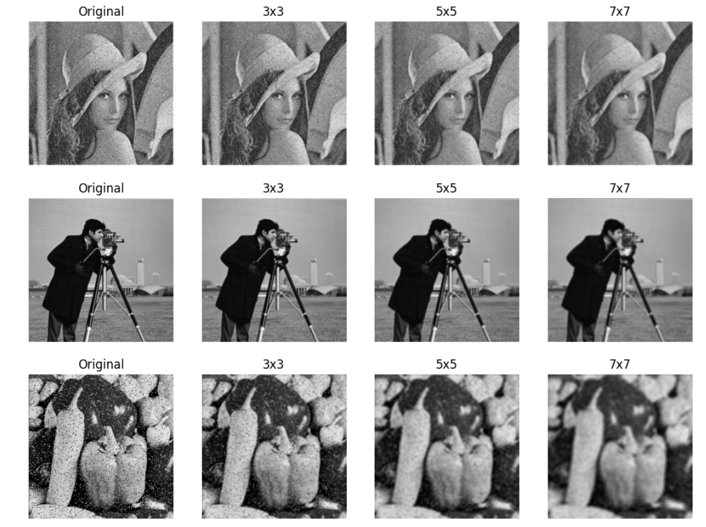
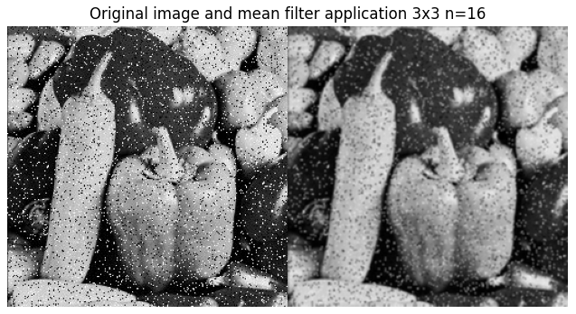
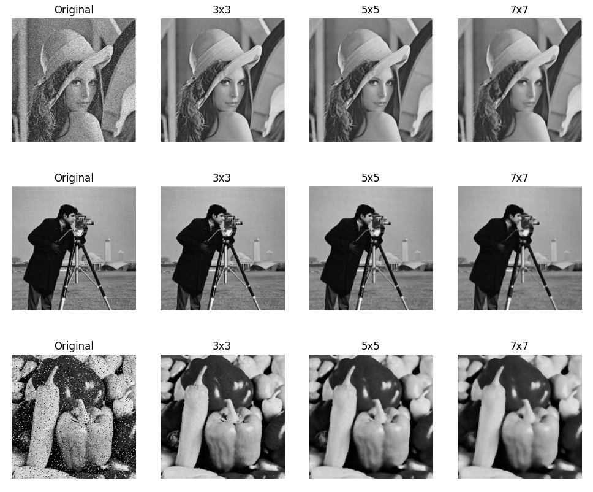

# Realce no domínio do Espaço

A filtragem no domínio do espaço é uma técnica de Processamento Digital de Imagens(PDI) que utiliza manipulações dos valores da vizinhança de um pixel para modificar uma imagem digital. Esta técnica utiliza uma matriz, também chamada de kernel, para percorrer toda a imagem e realizar as operações de filtragem que são necessárias. 

## Filtros de média

Os filtros de média são um tipo de filtragem no domínio do espaço utilizado para suavizar uma imagem. Ele utiliza os valores de média dos pixels, estes filtros também são conhecidos como filtros passa-baixa. Ao aplicar o filtro de média, o valor de cada pixel analisado, é  imediatamente substituído pela média dos pixels da vizinhança, com isso o resultado ocorre a perda da nitidez da imagem. Neste trabalho foram realizados experimentos variando o tamanho do filtro de média. Os filtros utilizados são exibidos abaixo.

De acordo com os resultados dos experimentos realizados, o filtro de média ajuda a suavizar a imagem diminuindo os ruídos. À medida que o tamanho do filtro aumenta, a suavização da imagem também aumenta, diminuindo uma maior quantidade de ruídos. Além disso, também pode-se perceber que alguns contornos da imagem também são borrados.  Os resultados dos experimentos são exibidos abaixo. 

## Filtros de mediana

Outro filtro existente é o filtro da mediana. Ele também é utilizado para suavizar as imagens, eliminando os ruídos do tipo sal e pimenta. Nesse filtro o pixel central da máscara é substituído pela mediana dos seus vizinhos. O filtro de Mediana é um dos filtros de suavização que melhor preserva as bordas em uma imagem. Abaixo exibe o resultado das imagens que foram suavizadas utilizando o filtro de mediana e vários tamanhos de máscaras.

Como fica claro nos experimentos. O filtro de mediana possui forte capacidade de suavização das imagens sem perder características importantes, como as bordas. À medida que o filtro aumenta, a suavização ocorre com mais eficiência. Além disso, também fica claro nos experimentos que o filtro de mediana possui melhor capacidade para suavizar imagens do que o filtro de média.  
