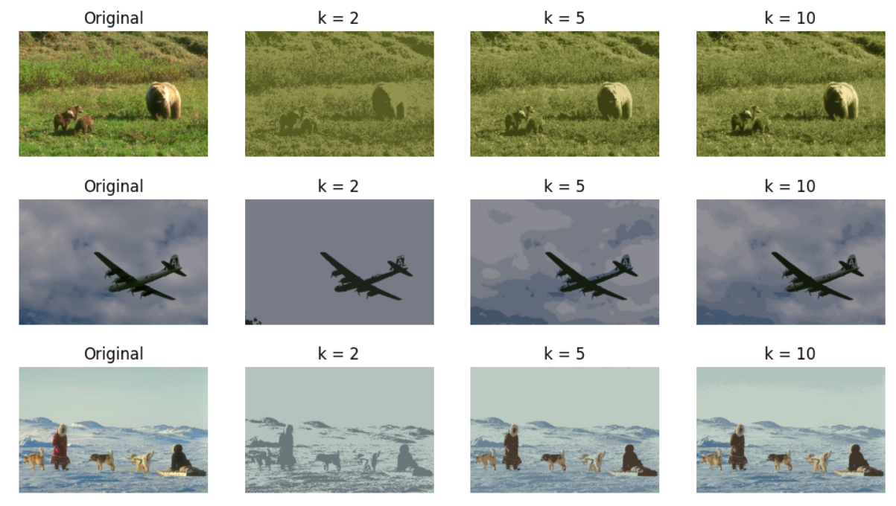
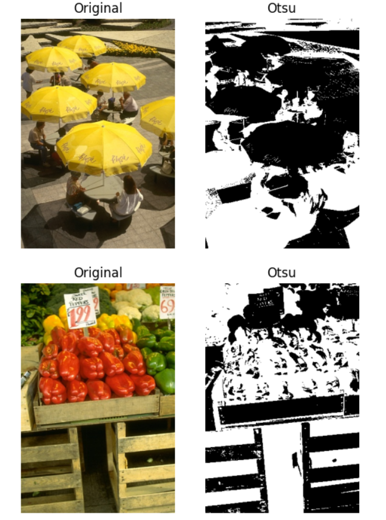
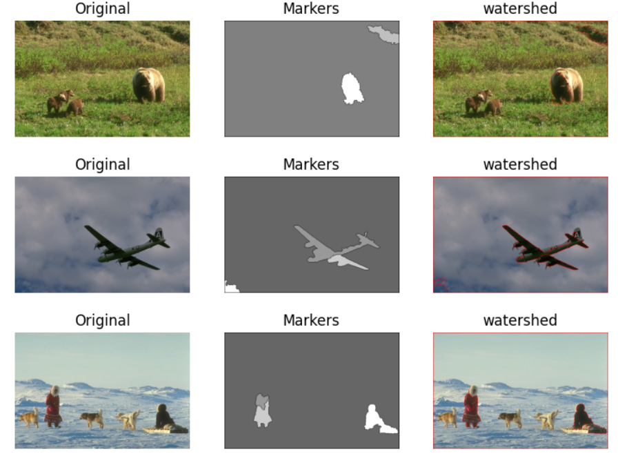

# Segmentação de Imagens

A segmentação de imagens é utilizada para dividir uma imagem digital em múltiplas regiões ou objetos, com o intuito de facilitar a sua análise. Segmentação de imagens é tipicamente usada para localizar objetos e formas em imagens. Existem inúmeros algoritmos de segmentação de imagens digitais, entre eles está o crescimento de região, técnicas de limiarização, como a limiarização adaptativa e de otsu, k means e watershed.

## kmeans

K Means é um algoritmo de agrupamento. Ele é usado para identificar diferentes classes ou clusters nos dados fornecidos com base na semelhança dos dados. Como fica claro nos experimentos abaixo, ao aplicar o kmeans em uma imagem, ele agrupa as cores da imagem em k cores, ou seja, quanto menor for o k, menos cores terá a imagem. No experimento abaixo tem uma imagem segmentada com o k igual a 2, deixando uma aparência de imagem “binarizada”, já imagens com k maiores aparentam possuir coloração mais parecida com a imagem original.

## Limiarização de Otsu. 

O método de Otsu é um algoritmo de limiarização. Seu objetivo é, a partir de uma imagem em tons de cinza, determinar o valor ideal de um threshold (limiar) que separe os elementos do fundo e da frente da imagem em dois clusters,   atribuindo   a   cor   branca   ou   preta   para   cada   um   deles.  Como demonstrado nos exemplos abaixo, o resultado da segmentação com limiar de otsu é uma imagem binarizada. 

## Watershed

A Transformada Watershed pode ser aplicada em imagens em nível de cinza para a segmentação. O nome refere-se metaforicamente a uma bacia hidrográfica geológica , ou divisor de drenagem, que separa bacias de drenagem adjacentes.  A Imagem é vista como a Topografia 3-D de uma área onde o valor da intensidade do pixel é plotado no eixo z, em cada coordenada (x,y). A Transformada Watershed segmenta as regiões considerando as áreas inundadas entre as linhas de Watershed como as regiões da imagem. Foram realizados experimentos para aplicar o watershed na imagens, antes disso a imagem foi convertida para a escala de cinza para ser binarizada utilizando o algoritmo de otsu. Além disso, cada imagem passou pela operação de abertura e dilatação e depois foi aplicado o algoritmo watershed. Nas imagens abaixo, as regiões com bordas vermelhas foram segmentadas pelo watershed, pode-se perceber que para alguns casos, esse algoritmo não é muito eficiente.

## Ferramentas

- Linguagem: Python
- Bibliotecas: OpenCv, Matplotlib, Numpy
- Ambiente de desenvolvimento: Jupyter Notebook